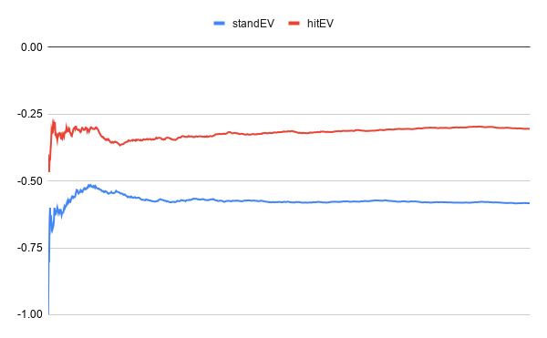
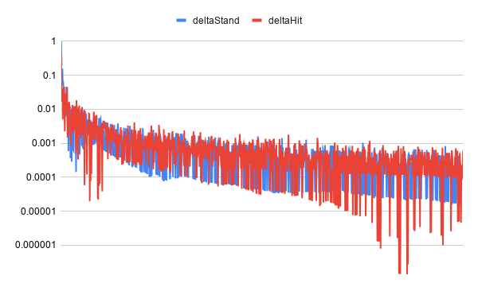

# Blackjack Strategy Engine

> **Project Status:** In Development

A C++ Blackjack strategy engine powered by Monte Carlo simulation. The program allows users to play Blackjack in the console and evaluate decisions by estimating the expected value (EV) of actions such as hit or stand.

Given a game state, the engine simulates millions of blackjack rounds and calculates the average outcome of each possible action to recommend the move with the highest EV.

Current number of simulations per decision: **10,000,000**

Multithreading with 4 CPU cores & stack-based memory allocation: **~17x faster simulation throughput**

```
g++ main.cpp src/*.cpp src/engine/*.cpp -Iinclude -o blackjack  // compile
.\blackjack                                                     // run
.\blackjack --backtest                                          // test using montecarlo
.\blackjack --baseline                                          // test using basic strategy
```

## Temporary Documentation

**Simulation Convergence Analysis** - Graphs from one random round of Monte Carlo simulation, used to test and visualise simulation stability and convergence.

### Expected Value Converence Graph



Stand EV stabilises around -0.58 to -0.60 and Hit EV around -0.33 to -0.34 as simulations increase, with early fluctuations smoothing out. The consistently higher Hit EV confirms a stable preference for hitting in this particular hand.

### Convergence Rate (Log Scale) Graph



Delta magnitude on a logarithmic scale drops from ~1e-1 to ~1e-3 as simulations increase, with an overall downward trend despite noise. This confirms the estimates are converging; each additional simulation has progressively smaller impact on the final EV values.

## TODO

- Expand decision space (split, double, insurance, etc.) - (in progress)
- Use simulation results for reinforcement learning model training
- frontend/ui for gameplay/simulation display